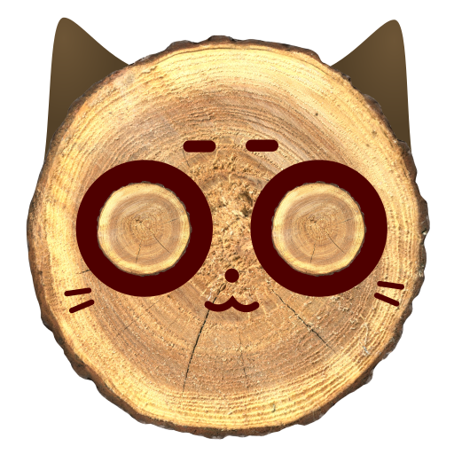

# Raftuś

An implementation of Raft in Rust.

This is just a learning project - its developers use it as an opportunity to learn Raft and Rust. Definitely meant for production.

The project is in early stages and nothing is implemented yet :3
